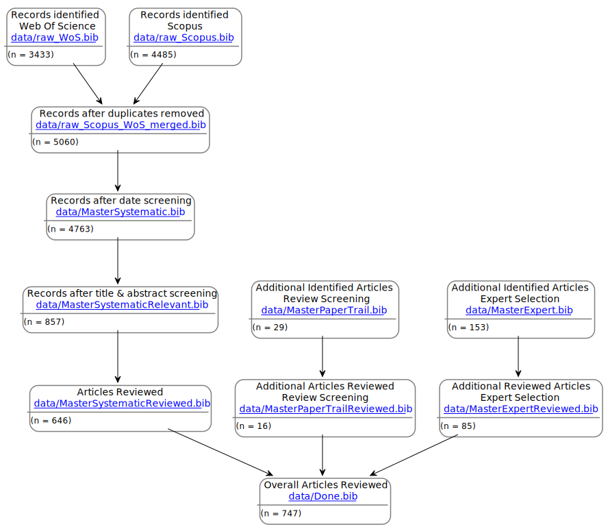

# IPBES Chapter 4 Literature Review Literature

This repository contains the bibliography files as used in the Systematic literature review in Chapter 4 of the IPBES Global Assessment.

The bibliographies are saved as `.bib` files. 

The bibliographies are linked as followed:

In addition, the following bibliographies are available:

* **[./data/SystematicLiteratureReview.bib](./data/SystematicLiteratureReview.bib)**: Complete set of all references in all `Master...` bibliographies **before** screening

* **[./data/MasterExpertAdditional.bib](./data/MasterExpertAdditional.bib)**: Additional References identified by authors (part of [./data/MasterExpert.bib](/data/MasterExpert.bib))
* **[./data/MasterExpertKeyPapers.bib](./data/MasterExpertKeyPapers.bib)**: Additional key References identified by authors (part of [./data/MasterExpert.bib](/data/MasterExpert.bib))

* **[./data/RootReviewPaper.bib](./data/RootReviewPaper.bib)**: Review paper used for the Review Screening and **not** included in the actual review

All are available in the directory **[./data/](./data/)**

<!-- 

## 1. Raw results from Systematic Literature Search (SLR)
* **[./data/raw_WoS.bib](./data/raw_WoS.bib)**: References returned from the Web of Science SLR 
* **[./data/raw_Scopus.bib](./data/raw_Scopus.bib)**: References returned from the Scopus SLR 
* **[./data/raw_Scopus_WoS_merged.bib](./data/raw_Scopus_WoS_merged.bib)**: Merged and duplicates removed from SLRs

### 2.1. Master SLR
* **[./data/MasterSystematic.bib](./data/MasterSystematic.bib)**: References from SLR after date screening

### 2.2. Master experts
* **[./data/MasterPaperTrail.bib](./data/MasterPaperTrail.bib)**: References from the Paper Trail Search based on Root Review Papers
* **[./data/MasterExpert.bib](/data/MasterExpert.bib)**: Combined `MasterExpertAdditional` and `MasterExpertKeyPapers`

### 

## 3. Relevant paper from Search
* **[./data/MasterSystematicRelevant.bib](./data/MasterSystematicRelevant.bib)**: References from search

## 4. Reviewed References
* **[./data/Done.bib](./data/Done.bib)**

### 4.1. Reviewed references split by source
* **[./data/MasterSystematicReviewed.bib](./data/MasterSystematicReviewed.bib)**
* **[./data/MasterPaperTrailReviewed.bib](./data/MasterPaperTrailReviewed.bib)**
* **[./data/MasterExpertReviewed.bib](./data/MasterExpertReviewed.bib)**

 -->
