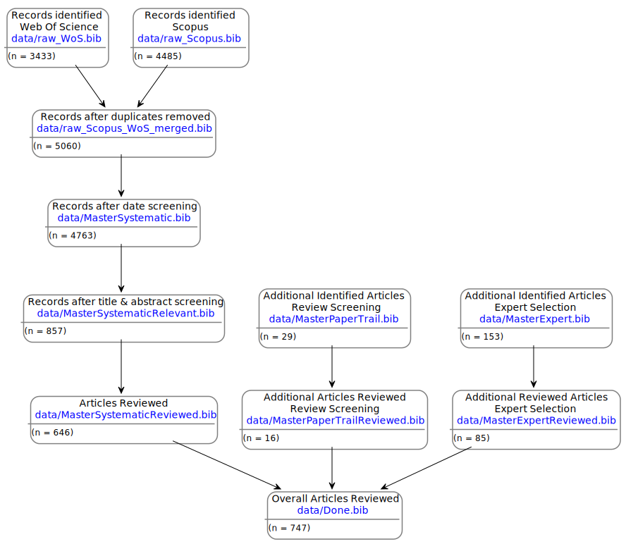

[](https://doi.org/10.5281/zenodo.3603072)

# IPBES Chapter 4 Literature Review Literature

This repository contains the bibliography files as used in the Systematic literature review in Chapter 4 of the IPBES Global Assessment.

The bibliographies are saved as `.bib` files. 

The bibliographies are linked as followed:



In addition, the following bibliographies are available:

* **[./data/SystematicLiteratureReview.bib](./data/SystematicLiteratureReview.bib)**: Complete set of all references in all `Master...` bibliographies **before** screening

* **[./data/MasterExpertAdditional.bib](./data/MasterExpertAdditional.bib)**: Additional References identified by authors (part of [./data/MasterExpert.bib](/data/MasterExpert.bib))
* **[./data/MasterExpertKeyPapers.bib](./data/MasterExpertKeyPapers.bib)**: Additional key References identified by authors (part of [./data/MasterExpert.bib](/data/MasterExpert.bib))

* **[./data/RootReviewPaper.bib](./data/RootReviewPaper.bib)**: Review paper used for the Review Screening and **not** included in the actual review

All are available in the **[data directory](https://github.com/rkrug/LargeScaleLiteratureReview_DataDeposit/tree/master/docs/data)** in the repository or in the data deposit on Zenodo.


## Search and identification of relevant literature

To identify the literature for the review, a three stage approach was used:

1. Literature search for original research articles (not reviews) using WoS [@ref] and Scopus [@ref] with following merging and removal of duplicates
2. Extraction of relevant papers using the citations in by the authors selected review papers and adding the missing articles
3. Supplementing reference list by using expert opinion to identify missing papers ("key paper")

Literature was limited to paper not older than 2008 and not newer than 2017.

### Search term WoS

```
TS=(
    "Global*" AND
    (
      "Future impact*" OR
      "Future effect*" OR
      "Future response*" OR
      "projecti*" OR
      "forecast*" OR
      "scenario*"
    ) AND (
      "species" OR
      "biological" OR
      "ecological" OR
      "nature" OR
      "biodiversity" OR
      "natural resource*" OR
      "organism*" OR
      "ecosystem*" OR
      "ecological service*" OR
      "conservation"
    )
   ) AND
SU=(
    "Agriculture" OR
    "Biodiversity & Conservation" OR
    "Biophysics" OR
    "Entomology" OR
    "Environmental Sciences & Ecology" OR
    "Fisheries" OR
    "Forestry" OR
    "Marine & Freshwater Biology" OR
    "Plant Sciences" OR
    "Zoology"
    )
```

### Search for Scopus

```
TITLE-ABS-KEY (
                ("global") AND
                (
                  "Future impact*" OR
                  "Future effect*" OR
                  "Future response*" OR
                  "projecti*"  OR
                  "forecast*"  OR
                  "scenario*"
                ) AND
                (
                  "species" OR
                  "biological" OR
                  "ecological" OR
                  "nature" OR
                  "biodiversity" OR
                  "natural resource*" OR
                  "organism*" OR
                  "ecosystem*" OR
                  "ecological service*" OR
                  "conservation"
                )
              ) AND
SUBJAREA (
          "agri" OR
          "envi"  OR
          "soci"  OR
          "econ"
         ) AND
DOCTYPE ( "ar" )
```


<!-- 

## 1. Raw results from Systematic Literature Search (SLR)
* **[./data/raw_WoS.bib](./data/raw_WoS.bib)**: References returned from the Web of Science SLR 
* **[./data/raw_Scopus.bib](./data/raw_Scopus.bib)**: References returned from the Scopus SLR 
* **[./data/raw_Scopus_WoS_merged.bib](./data/raw_Scopus_WoS_merged.bib)**: Merged and duplicates removed from SLRs


### 2.1. Master SLR
* **[./data/MasterSystematic.bib](./data/MasterSystematic.bib)**: References from SLR after date screening

### 2.2. Master experts
* **[./data/MasterPaperTrail.bib](./data/MasterPaperTrail.bib)**: References from the Paper Trail Search based on Root Review Papers
* **[./data/MasterExpert.bib](/data/MasterExpert.bib)**: Combined `MasterExpertAdditional` and `MasterExpertKeyPapers`

### 

## 3. Relevant paper from Search
* **[./data/MasterSystematicRelevant.bib](./data/MasterSystematicRelevant.bib)**: References from search

## 4. Reviewed References
* **[./data/Done.bib](./data/Done.bib)**

### 4.1. Reviewed references split by source
* **[./data/MasterSystematicReviewed.bib](./data/MasterSystematicReviewed.bib)**
* **[./data/MasterPaperTrailReviewed.bib](./data/MasterPaperTrailReviewed.bib)**
* **[./data/MasterExpertReviewed.bib](./data/MasterExpertReviewed.bib)**

 -->
